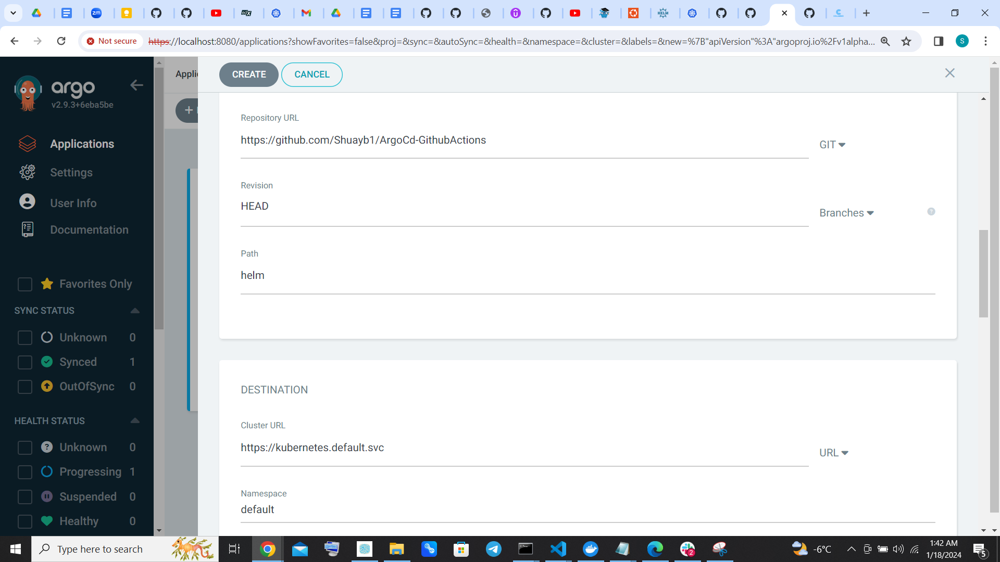

## CICD demo 
The goal of this document is to create a full CICD demo using the following tools 
- Helm 
- Github actions 
- ArgoCD 


## Process 

Prerequisites: 

- Git: Ensure Git is installed on your machine to manage your application’s source code.
- Docker: Install Docker to build container images for your application.
- Kubernetes Cluster : You will need a Kubernetes cluster to deploy your application. 
- Helm: Install Helm, the package manager for Kubernetes, to simplify the deployment and management of your application.
- DockerHub: DockerHub is a popular container registry that allows you to store and distribute your container images.


## Install ArgoCD 
To install ArgoCD ,  run the following commands 

```
kubectl create namespace argocd
kubectl apply -n argocd -f https://raw.githubusercontent.com/argoproj/argo-cd/stable/manifests/install.yaml
```

## On Windows

```
choco install argocd-cli
argocd login localhost:8080
argocd cluster add docker-desktop
```

## Set up Helm 
Step 1: Install Helm:

```
curl -fsSL -o get_helm.sh https://raw.githubusercontent.com/helm/helm/main/scripts/get-helm-3
chmod 700 get_helm.sh
./get_helm.sh
```

Step 2: Add the official Helm repository:
```
helm repo add stable https://charts.helm.sh/stable
Step 3: Update the Helm repositories:
```

helm repo update

## Set up the application 

Step 1: Create a directory for your application and navigate into it:
```
mkdir helm-tutorial
cd helm-tutorial
mkdir app
cd app
```

Step 2: Create a file named app.js and copy the following code into it:
```
const express = require('express');
const app = express();
const port = 3000;

app.listen(port);
console.log(`App running at http://localhost:${port}`);

app.get('/health', (req, res) => {
  res.send('OK');
  res.status(200);
});

app.get('/', (req, res) => {
  const name = process.env.NAME || 'World';
  res.send(`Hello ${name}!`);
});
```


Step 3: Create a file named package.json and copy the following code into it:
```
{
  "name": "app",
  "version": "1.0.0",
  "main": "app.js",
  "repository": "",
  "scripts": {
    "start": "node app.js"
  },
  "dependencies": {
    "express": "^4.16.2"
  }
}
```

Step 4: Create a file named Dockerfile and copy the following code into it:
```
FROM node:16-alpine
WORKDIR /src
COPY . .
RUN npm install --quiet
EXPOSE 3000
CMD npm start
```
Step 5: Build the Docker image:

`docker build -t app-helm:latest .`

Step 6: Test the application locally:

`docker run -p 3000:3000 app-helm:latest`

Open your browser and navigate to http://localhost:3000 to see the "Hello World" message. Accessing http://localhost:3000/health should return "OK".


## Setting Up the Helm Chart
To deploy our application using Argo CD, we need to create a Helm chart that defines the Kubernetes resources required, such as a Deployment, Ingress, Service and etc. Let’s go through the process of setting up the Helm chart for our application.

Step 1: Initialize a new Helm chart:

`helm create helm``

This will create a new directory named helm with the basic structure of a Helm chart.

Step 2: Modify the Helm chart files according to our application’s requirements.

Update helm/templates/deployment.yaml: Replace the content of the file with the following code:

```yaml
apiVersion: apps/v1
kind: Deployment
metadata:
    name: app-deploy
    labels:
      app: app
spec:
    replicas: 3
    selector:
        matchLabels:
            app: app
    template:
        metadata:
            labels:
                app: app
        spec:
            containers:
                - name: app
                  image: matesousa/app-helm:{{ .Values.env.APP_VERSION }}
                  ports:
                    - containerPort: 3000
                  env:
                  - name: NAME
                    value: 'Matheus'
                  readinessProbe:
                    httpGet:
                        path: /health
                        port: 3000
                    initialDelaySeconds: 10
                    periodSeconds: 10
                    successThreshold: 1
                    failureThreshold: 3
                  livenessProbe:
                    httpGet:
                        path: /health
                        port: 3000
                    initialDelaySeconds: 10
                    periodSeconds: 10
                    timeoutSeconds: 5
                    successThreshold: 1
                    failureThreshold: 3
```


Update helm/templates/service.yaml: Replace the content of the file with the following code:

```yaml
apiVersion: v1
kind: Service
metadata:
  name: app-service
  labels:
    app: app
spec:
    type: NodePort
    selector:
        app: app
    ports:
     - protocol: TCP
       port: 3000
       targetPort: 3000
       nodePort: 30080
```


Create a new file named ingress.yaml inside the templates directory and add the following content:
```yaml
apiVersion: networking.k8s.io/v1
kind: Ingress
metadata:
  name: ingress
  annotations:
    nginx.ingress.kubernetes.io/rewrite-target: /
spec:
  rules:
    - http:
        paths:
          - path: /
            pathType: Prefix
            backend:
              service:
                name: app-service
                port:
                  number: 3000
```

Step 3: Update the values.yaml file located in helm directory: Replace the content of the file with the following code (It refers to image tag):

```yaml
env:
  APP_VERSION: <desired_application_version>
```

## Setting Up GitHub Repository and Linking to the Application

To automate the deployment process using GitHub Actions, we need to set up a GitHub repository and link it to our existing application. Follow the steps below to create the GitHub repository, initialize Git, and push the application code.

Step 1: Create a new GitHub repository:

Go to https://github.com and sign in to your account.
Click on the “New” button to create a new repository.
Provide a name for your repository, such as “my-app”.
Optionally, add a description and choose the repository visibility settings.

Click on the “Create repository” button to create the repository.

Step 2: Initialize Git and link the repository:

Open a terminal or command prompt.

Navigate to the root directory of your application.

Initialize Git in the directory by running the following command:

`git init`

Add the remote repository URL as the origin by running the following command:

`git remote add origin <repository_url>` 

Replace <repository_url> with the URL of your GitHub repository. You can copy the URL from the repository page on GitHub.

Step 3: Commit and push the application code:

Stage the changes by running the following command:
`git add .`

Commit the changes with a meaningful message by running the following command:

`git commit -m "Initial commit"`

Push the code to the remote repository by running the following command:

`git push -u origin main`

## Setting Up Argo CD for Application Deployment

Now let’s set it up to deploy our application using Helm, ArgoCD and integrate it with our GitHub repository.

Step 1: Access the Argo CD UI:

Make sure you have the Argo CD command-line interface (CLI) installed.

Run the following command to port forward the Argo CD UI to your local machine:

`kubectl -n argocd port-forward svc/argocd-server 8080:443`

Open your browser and navigate to http://localhost:8080 to access the Argo CD UI.

Step 2: Log in to the Argo CD UI:

Retrieve the Argo CD admin password by running the following command:
`kubectl -n argocd get secret argocd-initial-admin-secret -o jsonpath="{.data.password}" | base64 -d`


Copy the password and paste it into the Argo CD login page in your browser.

Log in with the username admin and the password you copied.
Step 3: Create an application in Argo CD:

- Click on the “Applications” tab in the top navigation bar.
-  Click on the “New Application” button.
- Configure the following settings:
- Application Name: Enter a name for your application (e.g., “my-app”).
- Project: Choose the default project or create a new project.
- Repository: Enter the URL of your GitHub repository.
- Path: Enter the path to the Helm chart directory (e.g., helm/).
- Cluster URL: Select the target Kubernetes cluster.
- Namespace: Enter the target namespace for deployment (e.g., default).
- Values Files: Specify the path to your values.yaml file if you have custom values.
- Sync Policy: Choose “Automatic” to enable automatic synchronization with the repository.
- Auto-Sync: Enable the option to automatically sync the application.
- Click on the “Create” button to create the application.

The setup is this:





And the YAML format is thus:


Step 5: Verify the deployment in Argo CD:

After creating the application, you will be redirected to the application details page.

Wait for Argo CD to automatically sync the application. This process may take a few moments.

Once the synchronization is complete, you should see the deployment status and resources listed on the page.
Verify that the application resources are successfully deployed and running as expected.

## Setting Up GitHub Actions for Automated Deployment

To automate the deployment process using GitHub Actions, we will create a workflow file that incorporates your provided code. This workflow will trigger the deployment whenever a push event occurs on the master branch.

Step 1: Create the GitHub Actions workflow file:

In your GitHub repository, create the directory.github/workflows
Create a new file named cd.yaml and open it for editing.
Step 2: Add the workflow code to the cd.yaml file: Copy and paste the following code into the cd.yaml file:

```yaml
name: CD

on:
  push:
    branches:
      - master

env:
  DOCKERHUB_USERNAME: ${{ secrets.DOCKER_USERNAME }}
  DOCKERHUB_KEY: ${{ secrets.DOCKER_KEY }}
  IMAGE_NAME: app-helm

jobs:
  build-and-deploy:
    runs-on: ubuntu-latest

    steps:
      - name: Checkout code
        uses: actions/checkout@v2

      - name: Login to Docker Hub
        uses: docker/login-action@v1
        with:
          username: ${{ env.DOCKERHUB_USERNAME }}
          password: ${{ env.DOCKERHUB_KEY }}

      - name: Build Docker image
        run: docker build -t ${{ env.DOCKERHUB_USERNAME }}/${{ env.IMAGE_NAME }}:${{ github.sha }} .

      - name: Push Docker image
        run: docker push ${{ env.DOCKERHUB_USERNAME }}/${{ env.IMAGE_NAME }}:${{ github.sha }}

      - name: Update values.yaml
        run: |
          cd helm
          sed -i 's|APP_VERSION:.*|APP_VERSION: '${{ github.sha }}'|' values.yaml 
          git config --global user.name 'GitHub Actions'
          git config --global user.email 'actions@github.com'
          git add values.yaml
          git commit -m "Update values.yaml"
          git push

```

Step 3: Configure Docker Hub and GitHub secrets:

In your GitHub repository, go to the “Settings” tab.
In the left sidebar, click on “Secrets”.
Click on the “New repository secret” button.
Add the following secrets:

```
Name: DOCKER_USERNAME, Value: [Your Docker Hub username]
Name: DOCKER_KEY, Value: [Your Docker Hub access token or password]
```
Click on the “Add secret” button to save the secrets.

Step 4: Update GitHub Actions permissions:

In your GitHub repository, go to the “Settings” tab.
In the left sidebar, click on “Actions”.
Under the “Permissions” section, make sure that the following permissions are enabled:
Write, Read, Run workflows, Manage workflows
If any permissions are not enabled, click on the “Enable” button next to each permission to grant access.
With these steps completed, your GitHub repository is now set up with the GitHub Actions workflow for automated deployment using Argo CD. Whenever a push event occurs on the master branch, the workflow will build and push the Docker image, update the values.yaml file with the current commit SHA, and push the changes to the repository.

Make sure to replace [Your Docker Hub username] and [Your Docker Hub access token or password] with your actual Docker Hub credentials in the secrets configuration.


